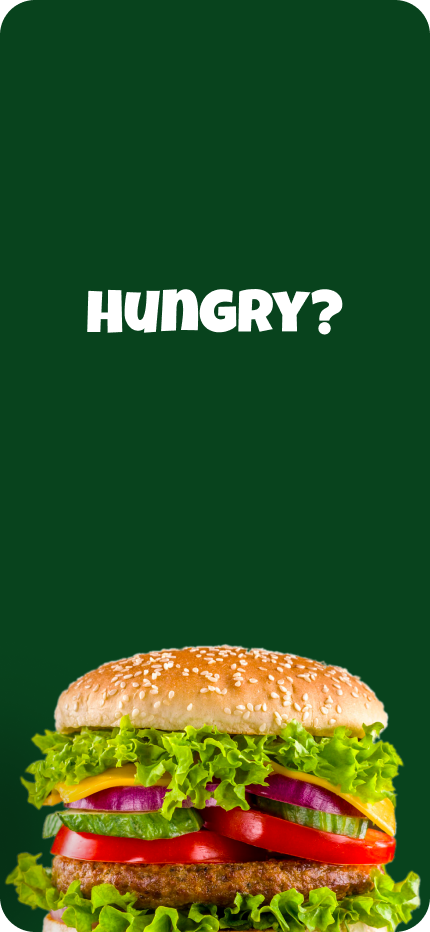
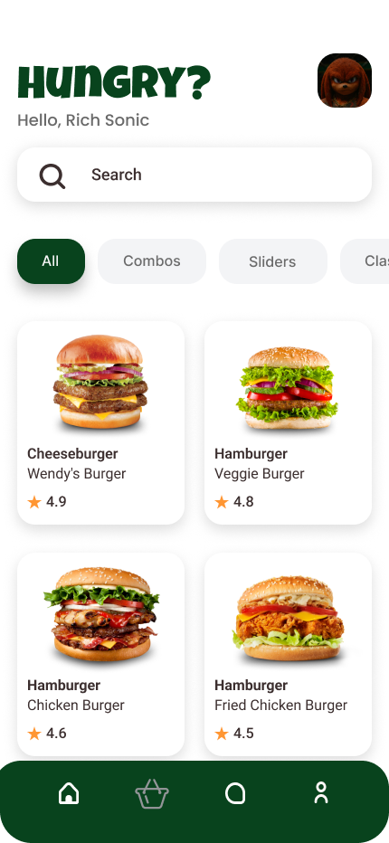
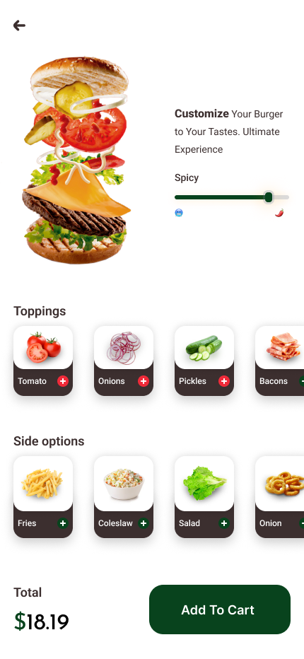
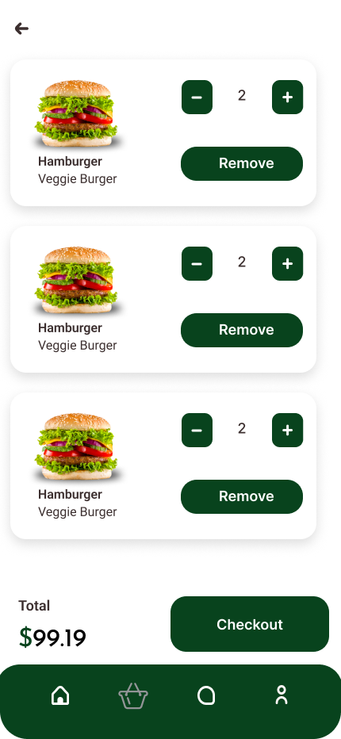
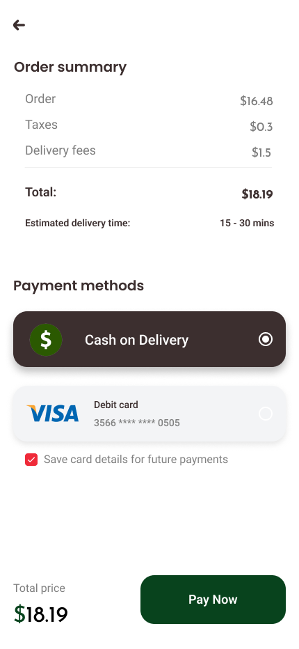
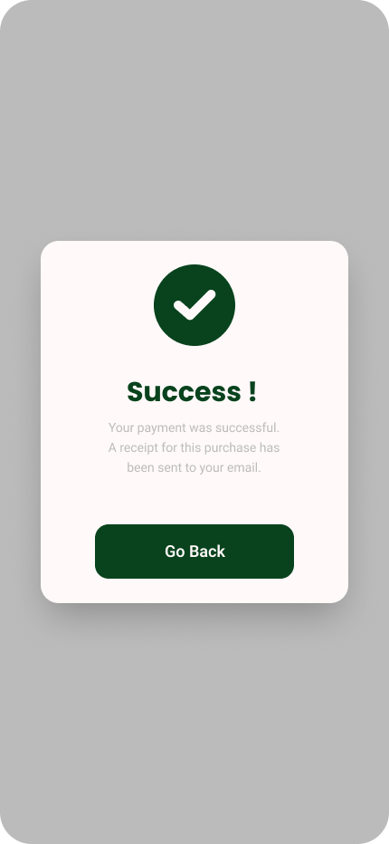
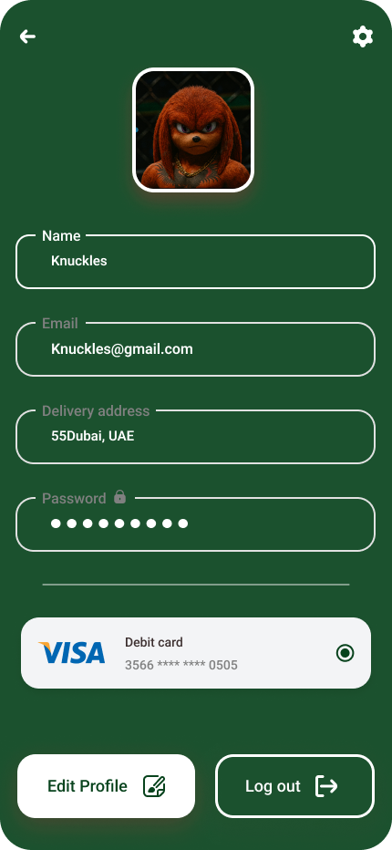

# 🍔 Hungry Flutter App

<div align="center">

## ✨ A Modern Food Delivery Experience Built with Flutter

**Hungry App** is a modern and intuitive food delivery application built with **Flutter**, designed to provide users with a smooth and enjoyable food ordering experience.

The application focuses on clean layouts, delicious food presentation, intuitive navigation, reusable UI components, responsive design, animations, loading states, and a streamlined ordering and checkout flow.


</div>

---

# 📌 Overview

**Hungry App** is a Flutter-based food delivery application that provides users with a complete food ordering journey — from discovering meals and viewing product details to adding items to the cart, completing checkout, and confirming a successful payment.

The application follows a modern and user-friendly design system with clean spacing, attractive food-focused layouts, responsive interfaces, intuitive interactions, reusable components, animations, and smooth loading experiences.

The project focuses on creating:

* 🍔 Modern food delivery UI
* 🎨 Clean and attractive design
* 🧩 Reusable Flutter components
* 📱 Responsive layouts
* 🛍️ Smooth food ordering experience
* 🛒 Simple and intuitive cart management
* 💳 Streamlined checkout and payment flow
* 👤 Complete authentication and profile experience
* ✨ Interactive animations and modern UI effects
* ⏳ Smooth loading states
* 🌐 API integration and network handling
* 🖼️ Image selection support
* 🧊 Interactive 3D model support

---

# ✨ Features

## 🚀 Splash Screen

* Attractive application launch screen.
* Displays the Hungry App branding.
* Smooth transition to the main application.
* Clean and minimal visual presentation.
* Supports animated visual elements.

---

## 🏠 Home Screen

* Modern food delivery home interface.
* Browse available food and meals.
* Featured and popular food items.
* Attractive food cards and categories.
* Easy navigation throughout the application.
* Clean and intuitive user experience.
* Responsive layout for different screen sizes.
* Smooth loading states while fetching content.

---

## 🍔 Product Details Screen

* Display detailed food information.
* Show product image and description.
* Display food price.
* Select product quantity.
* Add products directly to the cart.
* Clear and focused product presentation.
* Support for SVG assets and animated UI elements.
* Can support interactive 3D models.

---

## 🛒 Cart Screen

* View all selected food items.
* Increase or decrease item quantities.
* Remove products from the cart.
* Display individual item prices.
* Calculate the cart subtotal.
* Continue directly to checkout.
* Smooth and responsive user interactions.

---

## 💳 Checkout Screen

* Review the selected order.
* Display order summary.
* Review subtotal and total price.
* Manage checkout information.
* Select or review payment details.
* Complete the payment process.

---

## 🎉 Success Payment Screen

* Confirmation screen after successful payment.
* Clear order completion feedback.
* Display a successful payment state.
* Smooth transition after completing the order.
* Friendly and satisfying completion experience.
* Supports Lottie animations for a more engaging experience.

---

## 👤 Profile Screen

* Display user profile information.
* Manage personal account details.
* Access user-related options.
* Clean and organized profile interface.
* Easy navigation to account features.
* Support for selecting profile images from the gallery or camera.

---

## 🔐 Login Screen

* User authentication interface.
* Email and password fields.
* Clean login experience.
* Validation-ready form structure.
* Navigation to the signup screen.
* Simple and intuitive authentication flow.

---

## 📝 Signup Screen

* Create a new user account.
* Collect basic user information.
* Email and password registration fields.
* Clean and accessible registration form.
* Easy navigation back to login.
* Simple onboarding experience.

---

# 📱 Application Flow

The application follows a simple and intuitive food ordering flow:

```text
                 Splash Screen
                      │
                      ▼
                  Home Screen
                      │
                      ▼
              Product Details Screen
                      │
                      ▼
                  Cart Screen
                      │
                      ▼
                Checkout Screen
                      │
                      ▼
             Payment Success Screen
```

### Authentication Flow

```text
              Login Screen
                  │
                  ├───────────────┐
                  │               │
                  ▼               ▼
            Home Screen      Signup Screen
                                  │
                                  ▼
                             Home Screen
```

### Profile Flow

```text
              Home Screen
                  │
                  ▼
              Profile Screen
```

---

# 📸 Screenshots

## 🚀 Splash Screen

The application launch screen introducing the Hungry App brand before entering the main experience.

<p align="center">
  
</p>

---

## 🏠 Home Screen

The main food discovery interface where users can explore meals, categories, and featured products.

<p align="center">
  
</p>

---

## 🍔 Product Details Screen

A detailed product interface where users can view meal information, select quantity, and add the product to their cart.

<p align="center">
  
</p>

---

## 🛒 Cart Screen

A simple and intuitive cart interface for reviewing selected food items and managing quantities.

<p align="center">
  
</p>

---

## 💳 Checkout Screen

The checkout interface where users can review their order and complete the payment process.

<p align="center">
  
</p>

---

## 🎉 Success Payment Screen

A confirmation screen displayed after successfully completing the payment process.

<p align="center">
  
</p>

---

## 👤 Profile Screen

The user profile interface for viewing and managing personal account information.

<p align="center">
  
</p>

---

## 🔐 Login Screen

A clean authentication interface allowing existing users to securely access their accounts.

<p align="center">
  
</p>

---

## 📝 Signup Screen

A simple registration interface allowing new users to create an account.

<p align="center">
  
</p>

---

# 🏗️ Project Structure

```text
lib/
│
├── core/
│   ├── constants/
│   ├── helpers/
│   ├── network/
│   ├── theme/
│   ├── routes/
│   └── utils/
│
├── features/
|   ├── auth/
|   |   ├── data/
|   |   ├── views/
|   |   ├── widgets/
│   ├── home/
│   ├── product_details/
│   ├── cart/
│   ├── checkout/
│   ├── order_history/
│   └── profile/
│
├── shared/
│   ├── widgets/
│   └── components/
│
└── main.dart
```

---

# 🛠️ Technologies Used

| Technology          | Description                                      |
| ------------------- | ------------------------------------------------ |
| **Flutter**         | Cross-platform application development framework |
| **Dart**            | Main programming language                        |
| **Material Design** | UI design foundation                             |
| **Flutter Widgets** | Reusable interface components                    |

---

# 📦 Packages & Dependencies

The project uses the following Flutter packages to build a modern, responsive, and interactive application:

| Package                     | Purpose                                                          |
| --------------------------- | ---------------------------------------------------------------- |
| **cupertino_icons**         | Provides iOS-style icons                                         |
| **flutter_svg**             | Displays and renders SVG images and icons                        |
| **flutter_gap**             | Creates clean and consistent spacing between widgets             |
| **flutter_screenutil_plus** | Builds responsive and adaptive UI layouts                        |
| **dio**                     | Handles HTTP requests, API communication, and network operations |
| **shared_preferences**      | Stores simple data locally on the user's device                  |
| **skeletonizer**            | Creates modern skeleton loading states                           |
| **image_picker**            | Selects images from the gallery or camera                        |
| **animate_icons**           | Provides animated and interactive icons                          |
| **lottie**                  | Displays lightweight and beautiful animations                    |
| **model_viewer_plus**       | Displays and interacts with 3D models                            |
| **shimmer**                 | Creates animated shimmer loading effects                         |

---

# 🎨 UI & Design Packages

The application uses several packages to create a modern and visually appealing interface.

### 🍎 Cupertino Icons

**cupertino_icons** provides beautiful iOS-style icons that can be used throughout the application.

### 🖼️ SVG Support

**flutter_svg** is used to display scalable SVG images and icons while maintaining high visual quality.

### 📏 Consistent Spacing

**flutter_gap** helps create clean and consistent spacing between widgets, making the UI easier to maintain.

### 📱 Responsive Design

**flutter_screenutil_plus** helps build responsive interfaces that adapt smoothly to different screen sizes and devices.

### ✨ Animated Icons

**animate_icons** adds interactive animated icons that improve the visual experience of the application.

---

# 🌐 Networking & Local Storage

## 🚀 Dio

The application uses **dio** for handling network communication and API requests.

It can be used for:

* 🌐 HTTP requests
* 📡 API communication
* ⚡ Request and response handling
* 🛡️ Error handling
* 🔄 Interceptors
* 📥 Data fetching

## 💾 Shared Preferences

**shared_preferences** is used for storing lightweight data locally on the user's device.

It can be used for:

* ⚙️ Application settings
* 👤 User preferences
* 🔐 Simple session information
* 💾 Local application data

---

# ⏳ Loading Experience

To create a smoother and more polished user experience while data is loading, the application uses modern loading packages.

## 🦴 Skeletonizer

**skeletonizer** creates skeleton versions of UI components while waiting for data to load.

This provides:

* Smooth loading states
* Better perceived performance
* Modern user experience
* Cleaner loading placeholders

## ✨ Shimmer

**shimmer** adds animated shimmer effects to loading placeholders.

This helps make loading states feel more dynamic and visually appealing.

---

# 🖼️ Media & Visual Content

## 📸 Image Picker

**image_picker** allows users to:

* Select images from the device gallery.
* Capture images using the camera.
* Update profile images.
* Work with images selected directly from the device.

## 🎬 Lottie Animations

**lottie** is used to display high-quality and lightweight animations.

It can be used for:

* 🎉 Success animations
* ⏳ Loading animations
* 🚀 Onboarding animations
* ❌ Error states
* ✨ Interactive visual feedback

## 🧊 3D Models

**model_viewer_plus** allows the application to display and interact with 3D models.

This can provide:

* 🔄 Interactive model rotation
* 🔍 Zoom support
* 🧊 3D product visualization
* ✨ More engaging product experiences

---

# 🎨 Design System

The application follows a modern, clean, and food-focused design system.

## 📏 4pt Grid System

The UI follows a consistent spacing system to maintain visual balance, alignment, and hierarchy throughout the application.

## 🎨 Color Style

The interface uses a vibrant and appetizing color palette designed to create a friendly and engaging food delivery experience.

## 🔤 Typography

The application uses clean and readable typography with clear hierarchy, balanced spacing, and appropriate font sizing.

## 🧩 Reusable Components

Reusable Flutter widgets and components are used throughout the application to maintain consistency, reduce code duplication, and simplify future development.

---

# 📱 Responsive Design

The application is designed with responsive layouts in mind.

* 📱 Mobile-friendly interface
* 📐 Flexible layouts
* 📏 Consistent spacing
* 🧩 Reusable responsive widgets
* 🔄 Adaptable UI components
* 📲 Optimized mobile experience
* 📱 Support for different screen sizes

The project uses **flutter_screenutil_plus** to help maintain consistent sizing and responsive UI behavior across multiple devices.

---

# ✨ Enhanced User Experience

The combination of Flutter packages helps provide a polished and modern user experience.

The application includes:

* 🎨 Beautiful SVG graphics and icons
* 📱 Responsive layouts
* 🌐 API and network communication
* 💾 Local data storage
* ⏳ Skeleton loading states
* ✨ Shimmer effects
* 🎬 Lottie animations
* 🖼️ Image selection support
* 🔄 Animated interactive icons
* 🧊 Interactive 3D models

---

# 🔐 Authentication

Hungry App includes a dedicated authentication experience with:

* 🔑 Login
* 📝 Signup
* 📧 Email-based authentication UI
* 🔒 Password fields
* 👤 User profile
* 🔄 Smooth authentication navigation

---

# 🛒 Shopping Experience

The application provides a complete food ordering journey:

```text
Discover Food
      │
      ▼
View Product Details
      │
      ▼
Select Quantity
      │
      ▼
Add To Cart
      │
      ▼
Review Cart
      │
      ▼
Checkout
      │
      ▼
Complete Payment
      │
      ▼
Payment Success
```

---

# 🚀 Installation & Running

## Requirements

Make sure you have the following installed:

* Flutter SDK
* Dart SDK
* Android Studio or VS Code
* Android Emulator or Physical Device
* Xcode for iOS development

---

## 📥 Clone Repository

```bash
git clone https://github.com/your-username/hungry-app.git
```

Navigate to the project:

```bash
cd hungry-app
```

Install dependencies:

```bash
flutter pub get
```

Run the application:

```bash
flutter run
```

---

# 📦 Main Dependencies

Make sure the required packages are added to your `pubspec.yaml`.

```yaml
dependencies:
  flutter:
    sdk: flutter

  cupertino_icons:
  flutter_svg:
  flutter_gap:
  flutter_screenutil_plus:
  dio:
  shared_preferences:
  skeletonizer:
  image_picker:
  animate_icons:
  lottie:
  model_viewer_plus:
  shimmer:
```

Then run:

```bash
flutter pub get
```

---

# 🧪 Build

To create an Android APK:

```bash
flutter build apk
```

For a release build:

```bash
flutter build apk --release
```

To build for iOS:

```bash
flutter build ios --release
```

---

# 🤝 Contributing

Contributions are welcome!

To contribute:

1. Fork the repository.

2. Create a feature branch:

```bash
git checkout -b feature/your-feature
```

3. Make your changes.

4. Commit your changes:

```bash
git commit -m "feat: add your feature"
```

5. Push your branch:

```bash
git push origin feature/your-feature
```

6. Open a Pull Request.

---

# 📄 License

This project is licensed under the **MIT License**.

---

# 👨‍💻 Author

**Your Name**

Flutter Developer

GitHub: https://github.com/your-username

---

<div align="center">

⭐ **If you find this project useful, consider giving it a star!**

Made with ❤️ and Flutter

</div>
